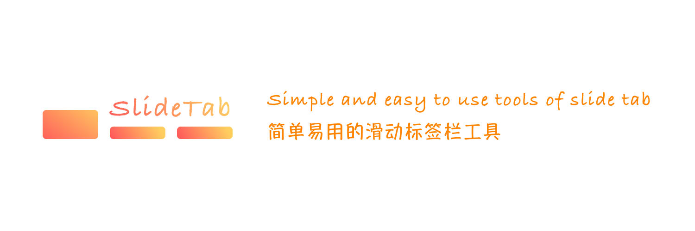
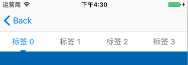
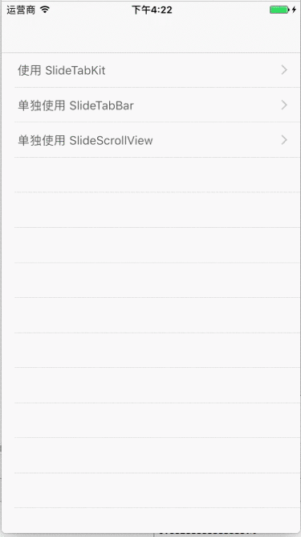
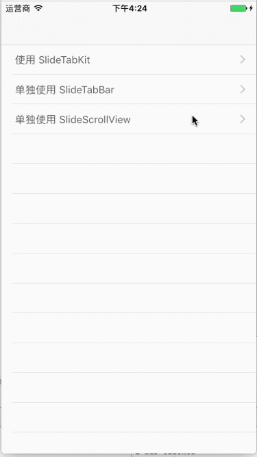
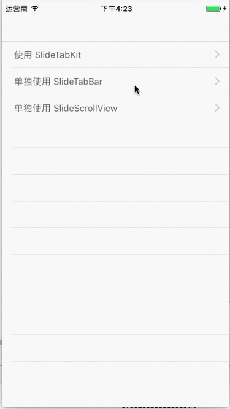

# SlideTabKit

   [](http://weibo.com/coderfish)



# 简介 

> [English Introduction](README.md)



SlideTabKit 简单易用的滑动标签栏工具，『标签栏工具』和『分页工具』和可以组合使用也可以拆分使用。

# 安装

```
pod 'SlideTabKit'
```

# 示例使用

## 使用 SlideTabKit 组合 Kit



```swift
var slideTabKit: SlideTabKit = SlideTabKit()
var vcs: [UIViewController] = []
var titles: [String] = ["标签 0", "标签 1", "标签 2", "标签 3"]

override func viewDidLoad() {
    super.viewDidLoad()

    for _ in 0 ..< 4 {
        let vc = UIViewController()
        vc.view.backgroundColor = UIColor.randomColor
        vcs.append(vc)
    }
    view.addSubview(slideTabKit.slideTabBar)
    slideTabKit.slideTabBar.snp.makeConstraints { (make) in
        make.top.equalTo(topLayoutGuide.snp.bottom)
        make.left.right.equalTo(view)
        make.height.equalTo(40)
    }
    slideTabKit.slideTabBar.resetting(titles: titles)

    view.addSubview(slideTabKit.slideScrollView)
    slideTabKit.slideScrollView.snp.makeConstraints { (make) in
        make.top.equalTo(slideTabKit.slideTabBar.snp.bottom)
        make.left.right.bottom.equalTo(view)
    }
    slideTabKit.slideScrollView.resetting(childViews: vcs.map({ (vc) -> UIView in
        return vc.view
    }))
}
```

## 单独使用 SlideTabBar



```swift

var slideTabBar0: SlideTabBar = SlideTabBar()

override func viewDidLoad() {
    super.viewDidLoad()

    // 设置 slideTabBar
    self.view.addSubview(slideTabBar0)
    // 其他属性设置完毕后调用 resetting
    slideTabBar0.resetting(titles: ["标签 1", "标签 2", "标签 3", "标签 4"])
    slideTabBar0.delegate = self

    slideTabBar0.snp.makeConstraints { (make) in
        make.top.equalTo(self.topLayoutGuide.snp.bottom)
        make.left.right.equalTo(self.view)
        make.height.equalTo(40)
    }
}
```

除了使用文字来初始化样式，也支持完全自定义 TabView 的样式。

## 单独使用 SlideScrollView



```swift
var vcs: [UIViewController] = []

override func viewDidLoad() {
    super.viewDidLoad()

    for _ in 0 ..< 4 {
        let vc = UIViewController()
        addChildViewController(vc)
        vcs.append(vc)
        
        vc.view.backgroundColor = UIColor.randomColor
    }

    self.view.addSubview(slideScrollView)
    let views = vcs.map { (viewController) -> UIView in
        return viewController.view
    }
    slideScrollView.resetting(childViews: views)
    slideScrollView.delegate = self
    slideScrollView.snp.remakeConstraints { (make) in
        make.edges.equalTo(self.view)
    }
}
```

# Demo

**建议您直接下载 [Demo](Demo) 工程查看 SlideTabKit 的各种使用姿势**

# 功能

- [x] 『标签栏 & 分页工具』组合工具
- [x] 『标签栏』单独使用
- [x] 『分页工具』单独使用
- [ ] 标签栏文字颜色渐变


# License

SlideTabKit 使用 [GNU General Public License v3.0](LICENSE)

# 反馈

如果有什么修改建议，可以发送邮件到 <coderfish@163.com>，也欢迎到我的[博客](http://zhoulingyu.com)一起讨论学习哟~


